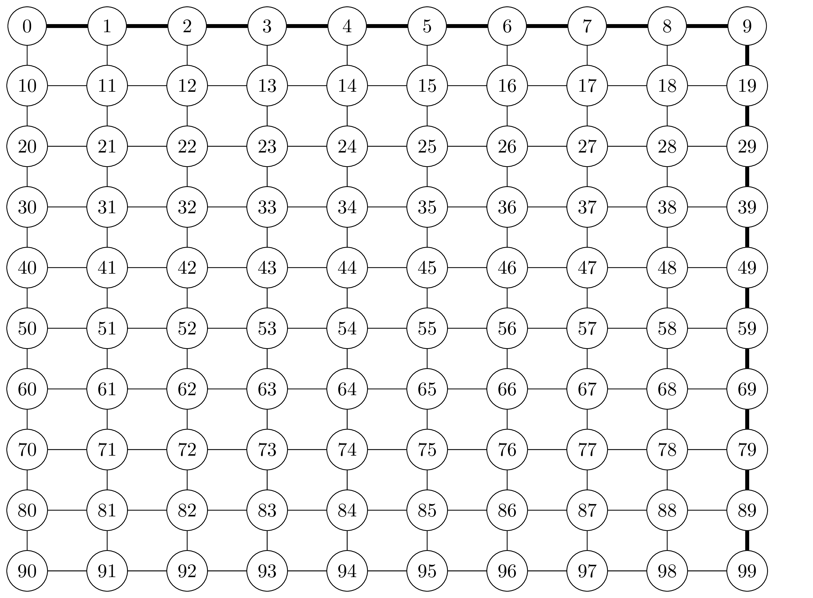

# Το Πρόβλημα των Περιπλανώμενων Καναδών

Ο Καναδάς είναι μια πολύ όμορφη χώρα με δριμύ χειμώνα. Το χειμώνα το χιόνι είναι συχνό και μπορούμε να θεωρήσουμε ότι τμήματα του οδικού δικτύου αποκλείονται λόγω χιονόπτωσης. Το επονομαζόμενο Πρόβλημα των Περιπλανώμενων Καναδών είναι το εξής:

* Οι (καναδοί) ταξιδιώτες γνωρίζουν όλη την τοπολογία του οδικού δικτύου. Το οδικό δίκτυο μπορεί να αναπαρασταθεί ως γράφος, όπου οι πόλεις είναι κόμβοι και οι δρόμοι μεταξύ τους είναι σύνδεσμοι. Οι σύνδεσμοι έχουν βάρη που αντιστοιχούν στο κόστος του ταξιδιού μεταξύ δύο κόμβων. 
* Μερικοί δρόμοι, δηλαδή σύνδεσμοι, κλείνουν, αλλά οι ταξιδιώτες δεν το ξέρουν αυτό εκ των προτέρων. 
* Οι ταξιδιώτες διαπιστώνουν ότι ένας σύνδεσμος μεταξύ δύο πόλεων v και u έχει κλείσει μόνο όταν φτάνουν στην πόλη v.
* Ευτυχώς το οδικό δίκτυο του Καναδά είναι αρκετά ανεπτυγμένο ώστε καμμία πόλη να μην αποκλείεται εντελώς: άρα πάντα μένουν αρκετοί δρόμοι ανοιχτοί για να το εγγυηθούν αυτό.
* Όταν κλείσει ένας δρόμος δεν ξανανοίγει, τουλάχιστον όσον αφορά ένα συγκεκριμένο ταξίδι.

Ποιο μονοπάτι θα ακολουθήσει ένας ταξιδιώτης για να μετακινηθεί μεταξύ δύο πόλεων με αυτές τις συνθήκες;

Για παράδειγμα, έστω ότι έχετε ένα οδικό δίκτυο με μορφή πλέγματος, και έστω ότι θέλετε να ταξιδέψετε από την τοποθεσία στην πάνω αριστερή μεριά του στην τοποθεσία που βρίσκεται στην κάτω δεξιά μεριά του. Με τον αλγόριθμο του Dijkstra θα προκύψει το ακόλουθο μονοπάτι: πηγαίνουμε ευθεία όσο μπορούμε και μετά αρχίζουμε να κατεβαίνουμε προς τα κάτω. Στην παρακάτω εικόνα μπορείτε να δείτε τι συμβαίνει: με έντονες γραμμές σηματοδοτούνται οι σύνδεσμοι που αποτελούν το μονοπάτι που θα ακολουθήσετε.



Αν όμως ξεκινήσετε και ανακαλύψετε στην πορεία ότι κάποιοι δρόμοι είναι αποκλεισμένοι, θα πρέπει να αναπροσαρμόσετε τη διαδρομή σας. Στην παρακάτω εικόνα θα δείτε ένα μονοπάτι που θα ακολουθήσει ένας ταξιδιώτης όταν διαπιστώνει στην πορεία ότι κάποιοι δρόμοι, τους οποίους σηματοδοτούμε με x, είναι κλειστοί.


## Άπληστος Αλγόριθμος

Πώς λύνουμε το Πρόβλημα των Περιπλανώμενων Καναδών; Ένας τρόπος είναι να ακολουθήσουμε τον παρακάτω *άπληστο (greedy) αλγόριθμο*:

* Αν f είναι ο κόμβος από τον οποίο ξεκινάμε και t είναι ο κόμβος στον οποίο θέλουμε να φτάσουμε, εκτελούμε τον αλγόριθμο του Dijkstra για να βρούμε το συντομότερο μονοπάτι από τον f στον t.
* Αρχίζουμε να ακολουθούμε το μονοπάτι. Αν στην πορεία, όταν είμαστε έτοιμοι να διασχίσουμε το σύνδεσμο (u, v), δούμε ότι ο σύνδεσμος είναι κλειστός, τότε εκτελούμε τον αλγόριθμο του Dijkstra για να βρούμε το συντομότερο μονοπάτι από τον u στον t *έχοντας αφαιρέσει από τον γράφο μας το σύνδεσμο (u, v)*. 
* Αρχίσουμε να εκτελούμε το μονοπάτι που βρήκαμε από τον u στον t. Αν πάλι δούμε ότι ένας σύνδεσμος που πάμε να διασχίσουμε είναι κλειστός, εκτελούμε εκ νέου τον αλγόριθμο του Dijkstra για να βρούμε το συντομότερο μονοπάτι από το σημείο που βρισκόμαστε μέχρι το t έχοντας αφαιρέσει πάλι τον κλειστό σύνδεσμο, κ.ο.κ.

Στην ουσία λοιπόν εκτελούμε τον αλγόριθμο του Dijkstra τόσες φορές όσες πέφτουμε σε κλειστό σύνδεσμο. Το συνολικό μας μονοπάτι προκύπτει από την ένωση των επιμέρους μονοπατιών που έχουμε βρει. Ο αλγόριθμος αυτός δίνει και τη λύση που μπορείτε να δείτε στην παραπάνω εικόνα.

## Αλγόριθμος Επανατοποθέτησης

Ο άπληστος αλγόριθμος μοιάζει με τη συμπεριφορά ενός οδηγού που θα αντιμετώπιζε τέτοιου είδους προβλήματα. Δεν είναι όμως πάντα η καλύτερη επιλογή. Για παράδειγμα, στο παρακάτω παράδειγμα, ο ταξιδιώτης πηγαίνει από τον κόμβο 0 στον κόμβο 1 με τελικό προορισμό τον κόμβο 2. Εκεί διαπιστώνει ότι ο σύνδεσμος (1, 2) είναι κλειστός. Το συντομότερο μονοπάτι προς τον 2 από τον 1 είναι μέσω του 3. Όταν φτάνει εκεί διαπιστώνει ότι ο σύνδεσμος (3, 2) είναι κλειστός. Το συντομότερο μονοπάτι προς τον 2 από τον 3 τότε είναι μέσω του 4, κ.ο.κ. οπότε ακολουθεί όλη τη διαδρομή 0, 1, 3, 4, 5. 


Αντί να χρησιμοποιήσει όμως τον άπληστο αλγόριθμο, ο ταξιδιώτης θα μπορούσε να είχε ακολουθήσει τον παρακάτω *αλγόριθμο επανατοποθέτησης (repositioning algorithm)*:

* Αν f είναι ο κόμβος από τον οποίο ξεκινάμε και t είναι ο κόμβος στον οποίο θέλουμε να φτάσουμε, εκτελούμε τον αλγόριθμο του Dijkstra για να βρούμε το συντομότερο μονοπάτι από τον f στον t.
* Αρχίζουμε να ακολουθούμε το μονοπάτι. Αν στην πορεία, όταν είμαστε έτοιμοι να διασχίσουμε το σύνδεσμο (u, v), δούμε ότι ο σύνδεσμος είναι κλειστός, τότε επιστρέφουμε στον αρχικό μας κόμβο f και εκτελούμε τον αλγόριθμο του Dijkstra για να βρούμε το συντομότερο μονοπάτι από τον f στον t *έχοντας αφαιρέσει από τον γράφο μας το σύνδεσμο (u, v)*. 
* Αρχίσουμε να εκτελούμε το νέο μονοπάτι που βρήκαμε από τον f στον t. Αν πάλι δούμε ότι ένας σύνδεσμος που πάμε να διασχίσουμε είναι κλειστός, γυρνάμε πάλι στην αρχή, αφαιρούμε τον σύνδεσμο από τον γράφο, εκτελούμε τον αλγόριθμο του Dijkstra, κ.ο.κ.

Άρα πάλι εκτελούμε τον αλγόριθμο του Dijkstra τόσες φορές όσες πέφτουμε σε κλειστό σύνδεσμο, αλλά κάθε φορά επιστρέφουμε στην αρχή. Το συνολικό μας μονοπάτι προκύπτει από την ένωση των επιμέρους μονοπατιών που έχουμε βρει. Αν εκτελέσουμε τον αλγόριθμο αυτό στο παραπάνω πρόβλημα, θα πάρουμε τη διαδρομή 0, 1, 0, 2.

## Απαιτήσεις Προγράμματος

Κάθε φοιτητής θα εργαστεί στο προσωπικό του αποθετήριο στο GitHub. Για να αξιολογηθεί μια εργασία θα πρέπει να πληροί τις παρακάτω προϋποθέσεις:

1. Όλη η εργασία θα πρέπει να βρίσκεται σε έναν κατάλογο `assignment-2015-5` μέσα στο αποθετήριο του φοιτητή.
2. Το πρόγραμμα θα πρέπει να έχει όνομα `ctp.py`.
3. Για την υλοποίηση του γράφου θα πρέπει να χρησιμοποιήσετε λίστες γειτνίασης (adjacency lists) και όχι πίνακα γειτνίασης (adjacency matrix). Εννοείται ότι δεν επιτρέπεται η έτοιμων βιβλιοθηκών γράφων.
4. Το πρόγραμμα θα μπορεί να καλείται ως εξής:
```
python ctp.py 
```
Οι αγκύλες δεν αποτελούν μέρος των πραγμάτων που δίνει ο χρήστης, απλώς χρησιμεύουν για να μας υπενθυμίζουν στην περιγραφή του προγράμματος ότι η συγκεκριμένη παράμετρος είναι προαιρετική. Έτσι έχουμε:

Αν δίνεται η παράμετρος-c, το πρόγραμμα θα χρησιμοποιεί τον αριθμό συνδέσμων κάθε κόμβου και όχι τη συνολική επιρροή. Δηλαδή, θα λειτουργεί όπως το πρώτο παράδειγμα που δώσαμε. Διαφορετικά, το πρόγραμμα θα χρησιμοποιεί τη συνολική επιρροή, δηλαδή θα λειτουργεί όπως το δεύτερο παράδειγμα.
Αν δίνεται η παράμετρος -r RADIUS το πρόγραμμα θα χρησιμοποιεί την τιμή RADIUS για το r definition, αλλιώς θα χρησιμοποιεί την τιμή 2.
Η παράμετρος num_nodes αντιστοιχεί στον αριθμό των κόμβων που θέλουμε να αφαιρέσουμε.
Η παράμετρος input_file είναι το όνομα του αρχείου που περιγράφει τον γράφο.
Το αρχείο input_file θα είναι της μορφής:

1 2
1 3
2 4
...
δηλαδή αποτελείται από γραμμές που η κάθε μία περιέχει δύο αριθμούς. Αν οι δύο αριθμοί είναι οι x και y, ο γράφος θα έχει ένα σύνδεσμο μεταξύ των κόμβων x και y. Ο γράφος δεν θα είναι κατευθυνόμενος, άρα θα θεωρούμε πάντα ότι θα υπάρχει και ο αντίστροφος σύνδεσμος από το y στο x. Οι κόμβοι θα είναι πάντα αριθμοί και θα είναι 1, 2, ...

Επαναλαμβάνουμε ότι η μορφή της εξόδου θα πρέπει να είναι ακριβώς όπως η παραπάνω για να μπορεί να αξιολογηθεί η εργασία.

Καλή Επιτυχία.
